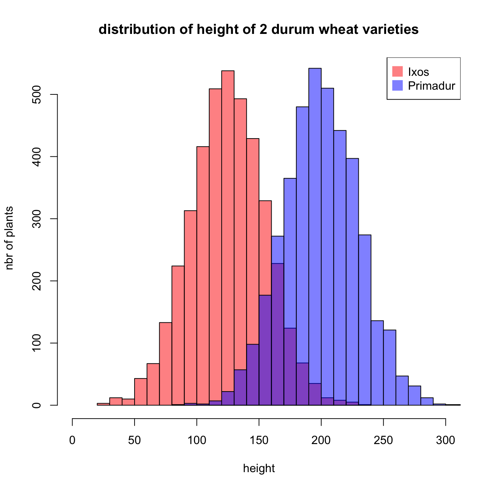

# Examining Serum Levels of Zinc and Copper in Individuals with Chronic Problematic Tinnitus

## Reference 

This is an original study conducted by myself, Valerie Ingalls,  as well as Dr. Ishan Bhatt, PhD, member and PI, respectively, of the Audiogenomics Lab, part of the 
Department of Communication Sciences and Disorders at the University of Iowa. Data for the study are taken from the National Health and Nutrion Examination Survey (NHANES), 
which has its data published publically available at their [website](https://www.cdc.gov/nchs/nhanes/index.htm).


## Introduction

Tinnitus, or the phantom perception of sound in abscence of external stimulus, which is commonly but not exclusively experienced as ringing in the ears, affects an estimated 
10% of US adults each year. This high prevalance makes it a very common disorder. The rate  increases with age, with nearly 5 million total individuals in their 50's 
experiencing tinnitus during a given year. There are numerous differences between tinnitus phenotypes that individuals experience. Tinnitus may manifest only in the short 
term, which is  known as acute tinnitus, or it may be experienced for multiple years, which is known as chronic tinnitus. Even among chronic tinnitus patients, some people 
perceive tinnitus consistently, while for others it is only present or discernible intermittently. A  significant portion of individuals with tinnitus report that it presents 
at least a moderate problem in their life, and over 1 million U.S. adults report it is a big problem. As a common disorder with a notable negative impact on those who have it, 
the importance  of treatment for tinnitus is clear. Those with chronic, problematic tinnitus represent the population of greatest clinical interest. 


While noise exposure is known to be the causal trigger for the manifestation of tinnitus, the exact biological origins of the disorder yet remain unclear. Moreover, it is not 
yet fully clear why, when two individuals are exposed to the same loud noise, it is possible that only one of them develops tinnitus in response. One leading theory is that 
tinnitus is connected to damage within the cochlea, the primary structure of the inner ear that is responsible for transduction of sound into the electrical signal that is 
passed to the brain. Zinc and copper are known to prevent free radical damage in the cochlea over time by neutralizing the superoxide radical. It is theorized that these 
molecules may have a protective effect against noise-induced cochlear damage, and therefore  tinnitus. It follows that their deficiency may result in tinnitus susceptibility. 
Previous studies examining this hypothesis have showed some promising results, but have largely been underpowered and lacking statistical significance. Further, several 
studies that attempted to use zinc for treating tinnitus neglected to examine pre-existing differences in zinc levels and rates of deficiency between individuals with and 
without tinnitus. With this project, we hold the goal of completing a  large-scale analysis of differences in the levels of zinc and copper in individuals with and without 
tinnitus, as well as the rates of deficiency, in order to determine whether there are population-level variations that could explain tinnitus susceptibility. 

### Example Figure

As this is an original study, I do not have a figure to replicate. Additionally, the previously mentioned studies did not use the type of visualization that I am planning to 
use, because their sample sizes were too small for a histogram to be an effective visualization. As such, I have pulled a somewhat similar example and will describe the 
differences that I plan for my final version. 



As you can see from this example, the goal is to create a plot with multiple histogram distributions on the same axis. I will be making two figures with the same underlying 
design, the only difference being whether the figure is for copper or zinc. Due to  differences in normative serum levels of copper and zinc, it is likely impractical to 
measure both metals on the same figure. On the x-axis for each figure will be level of serum copper (or zinc), while the y-axis will be density (preferable to a count y-axis 
in  this case because our generalized sample size is in the millions). One of the distributions will be for the no tinnitus control group, one distribution will be for 
individuals with chronic problematic tinnitus, while a third distribution will be for individuals  with other tinnitus phenotypes (either acute or unproblematic). I will also 
add a vertical line at the clinical cutoff value for deficiency  in those metals. In this way, I will visualize the difference in zinc and/or copper in those with chronic 
problematic tinnitus compared to the control groups of those with no tinnitus and those with clinically non-significant tinnitus, while simultaneously showing the proportion 
of individuals in each population who have a deficiency in that metal. 

## Materials and Methods 

This is a large-sample epidemiological study using data from the National Health and Nutrition Examination Survery (NHANES). 

### NHANES Data Collection 
The NHANES is a nationally representation health survey that is unique in that it makes use of both questionnaires and physical examinations to gather a robust set of health 
data. It began several decades ago with a series of multi-year surveys, the NHANES I, II, and III. The modern NHANES, known as the continuous NHANES, is a series of survey 
cycles, each lasting for two years. Individual cycles are constructed to be fully representative of the United States population; researchers are still encouraged to combine 
multiple cycles in order to increase the robustness of their dataset. The NHANES utilizes a complex stratified survey design in order to increase its representativeness. In 
summary: 

- Subpopulations of particular public health interest are identified (eg non-white Hispanic individuals)
- The total population is broken up into strata based on location, often but not always by county
- Strata are assigned a weight that increases their likelihood of being randomly selected for sampling based on the proportion of their population that includes the targeted 
subpopulation(s). Some strata are weighted so heavily as to be guaranteed for selection
- Weighted randomized selection of strata for the survey occurs
- A random selection of individuals from within those strata are actually surveyed
- Weights and strata information are then included in the NHANES data so that it is possible to accurately extrapolate results to the population level. All data are publicly 
available on the NHANES website.

### Data Selection and Processing 
Data from the NHANES are stored in .XPT format and are accessible via the website. In order to preserve metadata and avoid data corruption in the present study, we acquired 
data via CLI using the wget command in a bash shell. Two cycles, 2011-2012 and 2015-2016 were selected for this study, as the only ones to have full audiological datasets 
available alongside serum metal levels.

NHANES stores data separately by cycle and by subject matter. In the case of this study, we used data from a total of ten different sheets, five from each cycle. The first 
step in data wrangling was to combine these ten sheets into one master. This was accomplished in R (Version: RStudio 2022.07.2+576 "Spotted Wakerobin" Release 
(e7373ef832b49b2a9b88162cfe7eac5f22c40b34, 2022-09-06) for Windows Mozilla/5.0 (Windows NT 10.0; Win64; x64) AppleWebKit/537.36 (KHTML, like Gecko) QtWebEngine/5.12.8 
Chrome/69.0.3497.128 Safari/537.36), as were all future steps for data wrangling and analysis. Many variables of interest were obtained directly from the data, while others 
were derived or refactored from the raw NHANES data. As NHANES lists the age of any individuals 85 or older as 85 (in order to protect identities), it was necessary to 
refactor age into a factor variable, with the upper extreme being "80 or older". Several derived variables were created as well. Tinnitus type was sorted into 3 groups: no tinnitus, chronic bothersome tinnitus, and other tinnitus. "Other tinnitus" includes those 
individuals who have expereinced tinnitus within the last 12 months, but either **(a)** have not experienced it for at least a total of 1 year **(b)** do not report their tinnitus causing any problem in their life or **(c)** only experience tinnitus as a temporary 
response to exposure to loud noise. Deficiency was also derived for both zinc and copper levels, using pre-defined clinical cutoff values. Additionally, ethnicity was recoded to "White" and "Non-White". While this coding scheme potentially misses out on some true 
differences, it has been shown to be an effective representation of population stratification in previous tinnitus studies, and the simplicity has benefits for statistical analysis. Finally, the sample weights are halved for each individual, as is the standard 
NHANES protocol when combining two cycles together. For this study, we used the laboratory sub sample weights as our serum metal measurements come from this sub sample. 

### Analysis 
The NHANES provides survey design details that allow us to extrapolate our results to the entire US population. In order to make use of the complex survey design in our 
analysis, we need to use the survey package in R. This package contains functions for regression modeling, t tests, chisq tests, and various forms of graphing, along with 
other analysis tools. With that package, we can implement the survey design in both our histogram figure as well as any statistical analyses.

For full comparison of the groups we established (no tinnitus, chronic problematic tinnitus, and acute and/or non-problematic tinnitus), we will perform several types of 
statistical analyses. First, in order to examine stratification within our sample population, we will perform several chi square goodness of fit tests, examining differences 
in sex, ethnicity, and age across the different tinnitus types. Secondly, we will perform two multiple linear regression analyses, one with serum zinc level as the response 
variable, and one with serum copper level as the response variable, with sex, age group, ethnicity, and tinnitus type as the predictor variables. This will allow us to examine 
the effect of tinnitus type on serum metal levels while controlling for these other demographic variables. Finally, we will perform two logistic regression analyses with the 
same predictor variable, while the response variables will be deficiency in the metals, as defined by pre-established clinical values. This allows us to examine not just the 
discrete quantity of serum zinc and copper, but also the rates of deficiency across the different tinnitus groups.

### Figure Production 

These figures were generated using the `ggplot2` package in RMarkdown. geom_density() provides the main distributions for the plot, while geom_vline() is used to show the deficiency cutoff point. The `fill` aesthetic creates the grouping needed to differentaite 
between tinnitus types, while the `weight` aesthetic allows us to implement the weighting from the complex survey design into these plots. Further aesthetics specify details features that make the graph more visually appealing. A code snippet for one of the graphs 
is included below for easy reference:  

```
ggplot(data = df) +
  geom_density(mapping = aes(x = zinc, weight = weight, fill = tinnitus_type), alpha = .5) +
  geom_vline(xintercept = 61, color = "blue", linetype = 2) +
  scale_fill_discrete(labels = c("Chronic Bothersome Tinnitus", "Other Tinnitus", "No Tinnitus")) +
  labs(x = "Serum Zinc Level (\u03BCg/dL)", y = "Density", title = "Distribution of Serum Zinc Levels by Tinnitus Type", fill = "Tinnitus Type")
```  


## Results 

 


Preliminary results indicate no signficant difference in levels of serum copper or zinc between individuals with chronic bothersome tinnitus, other tinnitus types, or no 
tinnitus. However, as is clearly visible in these preliminary density plots, the distributions of metal levels are right-skewed. This indicates that it would be most 
appropriate to apply a transformation to the y-values of our multiple linear regressions, in order to determine whether there is a significant difference when the 
distributions are more normalized. 

Knowing that transformation is the next step in my analysis, I will not go into great detail regarding the preliminary results of statistical 
analyses, other than to point out a few facts. As mentioned, no significant relationship was found between tinnitus type and either serum copper level or serum zinc level. 
Additionally, no relationship was found between tinnitus type and rates of clinical deficiency for either metal. Initial chi-square tests showed that there is significant 
stratification of tinnitus prevalence by both age group and ethnicity, but not by sex. These differences were expected given past epidemiological studies of tinnitus 
prevalence and do not present a threat to the validity of our current results, as our models control for these factors.
